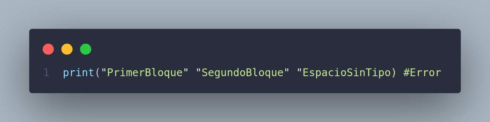
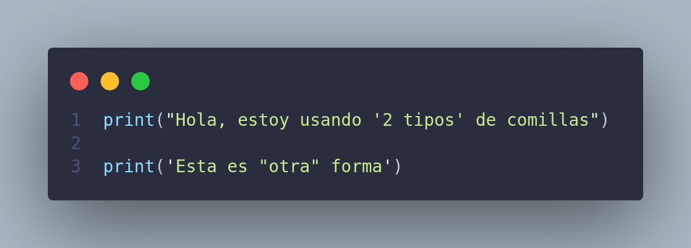
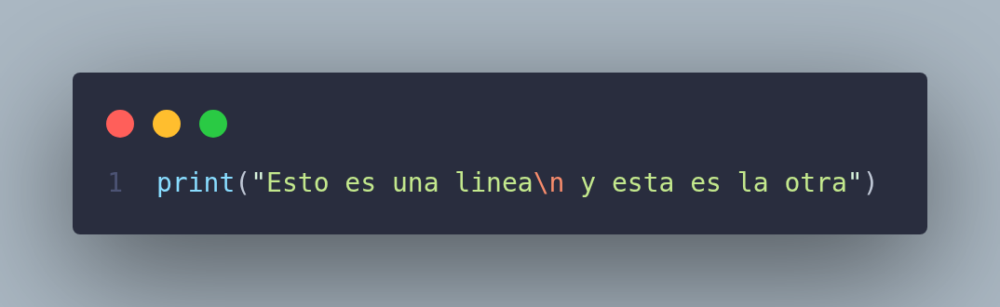
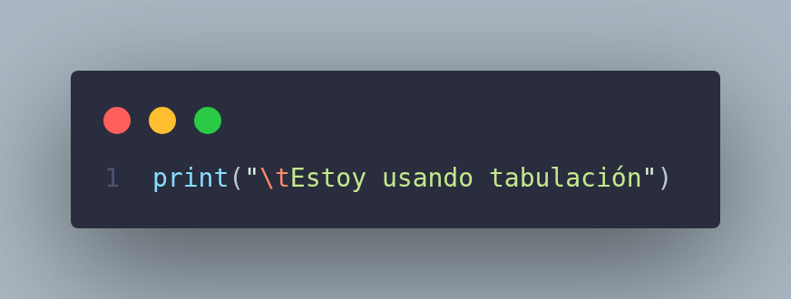
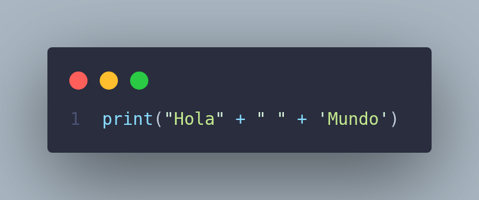

# Strings

## Strings

Son cadenas de texto, no tienen un valor concreto, únicamente caracteres de texto, estos se definen con comillas dobles `""` o comillas simples `''` .

Todo lo escrito dentro de los 2 tipos de comillas será convertido a `string`  o texto, esto incluye caracteres, números (los cuales ya no actuarán como valores sino como caracteres también), símbolos etc.

### Escritura

Dentro de un string no se pueden agregar más comillas (de las mismas que se usaron para el texto) porque python lo interpreta como fin del bloque.



Pero si se pueden usar los 2 tipos de comillas para representarlas en texto así:



O también se puede manejar de este sentido:

[](../../../imgs/4.Strings.png)

- Las barras invertidas `\` hacen que el siguiente caracter después de ellas sea tomado como un caracter especial (la instrucción debe de estar dentro de un string o comillas para que sea válida).

### Salto de linea

Se pueden hacer saltos de línea en la misma línea de código de la siguiente forma:



Python interpreta `\n` como un salto a la siguiente línea de código, esta instrucción debe de estar dentro de un string para que sea válida.

También existe la forma de tabulación, esta lo que hace es agregar 4 espacios donde sea usado `\t` (debe de estar dentro de un string para ser válida): 



### Concatenación

Es la unión de 2 cadenas de texto por medio de la función `print` 



Esta concatenación realiza la unión de todas las cadenas de texto por medio del operador suma `+` haciendo que el código muestre por pantalla

```python
Hola Mundo
```

<aside>
❗
Hay que tener en cuenta que la concatenación une 2 strings tal cual están escritos, si no se maneja el espacio intermedio en una u otra frase o incluso explicito como el ejemplo, la muestra en pantalla sería:
”Holamundo”

</aside>