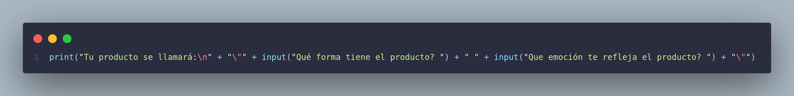

## Enunciado

Diseña un código para un amigo tuyo que le ayude a crear el nombre de su producto nuevo que va a vender.

Para esto crea un código que le haga 2 preguntas en las cuales el deba responder con solo una palabra (si quiere responder con más no hay problema). Pueden ser 2 preguntas a elección del programador, para al final mostrar el siguiente ejemplo:

```python
El nombre del producto es 
"Palabra1 palabra2"
```

<aside>
❗

Se deben usar concatenaciones de strings, saltos de línea y agregarle comillas a el nombre del producto

</aside>

### Solución

